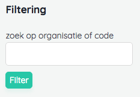

# Advanced Page Management

## Authorization & authentication
Note that Chief has separate tables for the chief admin users, `chief-users` and `chief_password_resets`. This way there is no interference with your application user logic.


## Grouping pages in the pagebuilder

One of the ways to group pages together is to add them to the pagebuilder next to eachother.
These pages will be grouped and the view can be customized by creating a view in the modules folder with the name of the type of page.
For instance, lets take a page called product. We can make multiple product pages.
Now if we want to show 3 products on the homepage we can add those products in the pagebuilder and if we have a view 'modules/product.blade.php'
that view will be used to render those items.

To get this working properly make sure you filename is the same as the key you defined that page as in the Chief.php config file.

## Using query sets

A pageset is a collection of pages that can be added to a page as a module. 
In addition to this a pageset allows you to define query scopes.
This lets you filter the collection by published or other query scopes as you see fit.

### Creating sets
A set is a custom grouping of pages, modules or other models.

To create a set for a page you make a file in the src/Sets folder.

```php
<?php
 namespace Thinktomorrow\Chief\Tests\Feature\PageSets;
 use Thinktomorrow\Chief\Pages\Page;
 use Thinktomorrow\Chief\Sets\Set;

 class DummyPageSetRepository
{
    public function all($limit = 100)
    {
        $pages = Page::limit($limit)->get();
        return new Set($pages);
    }
} 
```

The next thing to do is to add a reference to this pageset in the chief.php config file.

You need to define the pageset in the pagesets array so the admin-panel has knowledge of this new pageset.


```php
'pagesets' => [
    'published' => [
        'action' => PublishedPageSet::class.'@published',
        'parameter' => [1],
        'label'     => 'published pages'
    ]
]
```

There are a few things we can define here. For starters the required field is the action which defines the class. If no method is defined (@method), the name of the array is used.
The parameter accepts an array with parameters for this method.
If the label is defined this will be used as the name of this pageset in the adminpanel. If label is not defined the name of the array is used.

### Customizing pagesets
To customize how a pageset renders we can also customize the view that would be used.

To create a view for this specific module, we create views/front/modules/published.blade.php in this case.
The name of the view should be the same as the pageset type as defined in the chief config file.
You can also put this file in a folder with the name of a page to define a view specificly for this page and pageset.

In this view we have access to the following variables:
- $pages and $parent for a set of pages.
- $collection and $parent for a set of modules or models.

### Using Pagesets
Once this setup is done we can create instances of these pagesets from the admin panel.
And following that to add them to a page, simple select them from the pagebuilder dropdown.

## Using snippets


# Advanced Model Management

## Localization
## Tweaking the admin form
## Custom routes (e.g. publish/archive)


## Filters
It is possible to add filtering on the admin index pages. Filters allow the administrator to query index results with custom behaviour.
For example searching by title via a text input or selecting between published or drafted items. By default, there are no filters set on a manager. 

Let's add some filtering.

### Defining filters
Filters are defined in the Manager class via the `filters` method. This returns a `Thinktomorrow\Chief\Filters\Filters` instance which acts as the filter collection:
```php 
use \Thinktomorrow\Chief\Filters\Filters;
...

public static function filters(): Filters
{
    return new Filters([
        LocaleFilter::class
    ]);
}
```

A Filter class should extend from the base `\Thinktomorrow\Chief\Filters\Filter` class and needs to define two methods: an `init()` which boots the filter instance and an `apply` function.
Here's an example:

```php

use \Thinktomorrow\Chief\Filters\Filters;

...
class SearchFilter extends InputFilter
{
    public static function init()
    {
        return static::make('search');
    }

    public function apply($value = null): Closure
    {
        return function($query) use($value){
            return $query->where('name','LIKE', '%'.$value.'%');
        };
    }
}
```

This will add a search field in the sidebar of your index like so:



Optionally you can add:
a `label` property to set a custom label. By default the input name is used.
A `description` property to add a small description below the field.


### Input filter
The input filter allows the user to query by textual input. A search field is a good use case. As shown in the example above, there are
a couple of values to be set. 

### Select filter
The select filter allows the user to choose between a set options. Here you should also set the options via an `options` property.
```php{8}
use Closure;
use Thinktomorrow\Chief\Filters\Types\SelectFilter;

class LocaleFilter extends SelectFilter
{
    public $label = 'Language';

    public $options = ['nl','fr'];

    public static function init()
    {
        return static::make('language');
    }

    public function apply($value = null): Closure
    {
        return function($query) use($value){
            return $query->whereIn('locale',[$value]);
        };
    }
}
```
