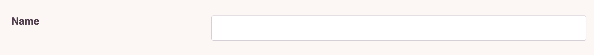
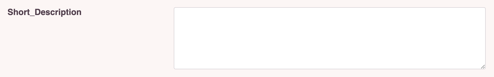
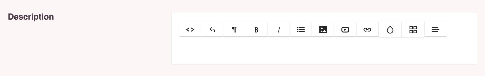
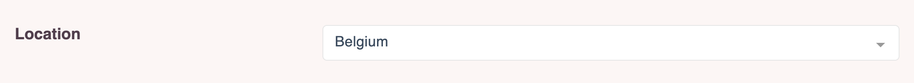

# Fields

## Adding fields
Each Manager has a `fields()` method. This method returns all available form fields.
Chief has the most commonly used fields already at your disposal, such as text and select input, checkboxes, textarea and wysiwyg input.
If your project requires another input type, you can always [create a custom field](#create-a-custom-field) as well.

Define your fields in the `fields()` method of the manager. This method should return a `\Thinktomorrow\Chief\Fields\Fields` class.
The first argument for this `Fields` class is an array of field objects. Each field should extend the `\Thinktomorrow\Chief\Fields\Field` class.

```php
use \Thinktomorrow\Chief\Fields\Fields;
use \Thinktomorrow\Chief\Pages\PageManager;
use \Thinktomorrow\Chief\Fields\Types\TextField;
use \Thinktomorrow\Chief\Fields\Types\InputField;

class AuthorManager extends PageManager
{
    public function fields(): Fields
    {
        return new Fields([
            InputField::make('name'),
            TextField::make('bio'),
        ]);
    }
}
```

## Available fields
- [InputField](#inputfield)
- [TextField](#textfield)
- [HtmlField](#htmlfield)
- [SelectField](#selectfield)
- [RadioField](#radiofield)
- [ImageField](#imagefield)
- [FileField](#filefield)
- [DateField](#datefield)

### InputField

The input field will render a basic input field.
It has no special options.

```php
InputField::make('name'),
```



### TextField

The text field will render a basic text field without wysiwyg functionality.
It has no special options.

```php
TextField::make('name'),
```



### HtmlField

The html field will render a wysiwyg field.
It has no special options.

```php
HtmlField::make('name'),
```



### SelectField

The select field will render a dropdown.
Some required options for the selectfield are:
- options: this is where you set the possible select options
- selected: this is the currently selected value
- multiple: this is a true or false value to denote is you are allowed to make multiple selections

```php
SelectField::make('countries')
            ->options(['Belgium', 'America', 'Canada'])
            ->selected($this->model->countries)
            ->multiple(true),
```



### RadioField

The radio field will render radio buttons.
It extends the selectfield and has all it's options:
- options
- selected
- multiple

```php
RadioField::make('gender')
            ->options(['Male', 'Female', 'Other'])
            ->selected($this->model->gender)
            ->multiple(false),
```


### ImageField

The image field will render a dropzone for image uploads.
It has the following extra options:

- multiple: this is a true or false value to denote is you are allowed to make multiple selections
- validation: These follow the working of standard chief validation rules. Possible validation rules are :required, mimetypes, dimensions, min, max

```php
ImageField::make('banner')->multiple(false),
```


### FileField

The file field will render a dropzone for file uploads.
It has the following extra options:

- multiple: this is a true or false value to denote is you are allowed to make multiple selections
- validation: These follow the working of standard chief validation rules. Possible validation rules are :required, mimetypes, dimensions, min, max

```php
FileField::make('CV')->multiple(true),
```


### DateField

The date field will render a field with a date selector.
It has no special options.

```php
DateField::make('birthdate'),
```

:::tip
To display this date correctly across all pages you need to define the field in the dates array on the model.
:::


## Available options

The following are the default available options on all fields:

- make: the name of the field, also corresponds to the database column name
- label: the label shown in the admin panel
- description: the description shown underneath the label in the admin panel
- validation: the laravel validation rules applied to this field. More on this in the section [Validation](#validation).
- translated: the languages in which this field should be translated. More on this in the section [Localisation](#localisation).
- default: set the default value for this field.
- valueResolver: set a callback that will be used to determine how this value should be filled. Useful if the field is saved on a pivot or in a json field.

An example of a basic field with all these options filled in could look like this:

```php
InputField::make('title')->translatable(['en', 'nl'])
                        ->validation('required-fallback-locale|max:200')
                        ->label('Page Title')
                        ->description('Title to be used in the admin.')
                        ->default('Standard pagetitle')
                        ->valueResolver(function($model, $locale){
                            return $model->pagetitle();
                        }),
```

## Create a custom field
## Field arrangements
All fields are

## Page fields

## Validation

## Localisation
:::tip
If you define a field as translatable you will have to override the `translatedAttributed` on the model so the translated field can be fetched.
```
protected $translatedAttributes = ['title', 'content', 'title_bg'];
```
In this case we added the title_bg field so we have to override all translated fields.
:::

### Validating fields

- intro: eloquent model, custom object, Page and Module are 2 in-house types of managers
-

### Field

This is the basic field. You would not use this to define a field on a model.
Instead you define one of the more specific fields.
This class provides some global function that are useful for a field like if it's translatable, its validation, label and description.

A basic input field might look like this:

```php
InputField::make('title')->translatable(['en', 'nl'])
                        ->validation('required-fallback-locale|max:200')
                        ->label('Page Title')
                        ->description('Title to be used in the admin.'),
```

:::tip
If you define a field as translatable you will have to override the `translatedAttributed` on the model so the translated field can be fetched.
```
protected $translatedAttributes = ['title', 'content', 'title_bg'];
```
In this case we added the title_bg field so we have to override all translated fields.
:::
