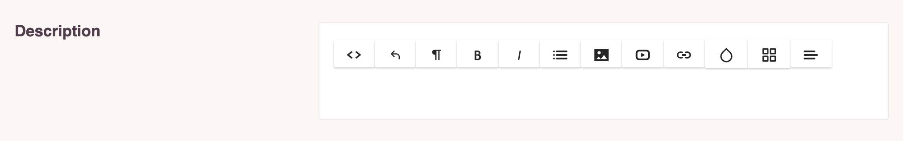

# Fields

A field instance represents a single form input. Each field defines the display and behaviour of this input.
Below you can find the available fields that come with a chief installation. 
You are free to create or customise these field classes. The only requirement is that a field should 
always implement the `Field` interface.

## Options

## Available fields
- [InputField](#inputfield)
- [TextField](#textfield)
- [HtmlField](#htmlfield)
- [SelectField](#selectfield)
- [RadioField](#radiofield)
- [ImageField](#imagefield)
- [FileField](#filefield)
- [DateField](#datefield)

### InputField

The input field will render a basic input field.
It has no special options.

```php
InputField::make('name'),
```


### TextField

The text field will render a basic text field without wysiwyg functionality.
It has no special options.

```php
TextField::make('name'),
```


### HtmlField

The html field will render a wysiwyg field.
It has no special options.

```php
HtmlField::make('name'),
```



### SelectField

The select field will render a dropdown.
Some required options for the selectfield are:
- options: this is where you set the possible select options
- selected: this is the currently selected value
- multiple: this is a true or false value to denote is you are allowed to make multiple selections

```php
SelectField::make('countries')
            ->options(['Belgium', 'America', 'Canada'])
            ->selected($this->model->countries)
            ->multiple(true),
```


### RadioField

The radio field will render radio buttons.
It extends the selectfield and has all it's options:
- options
- selected
- multiple

```php
RadioField::make('gender')
            ->options(['Male', 'Female', 'Other'])
            ->selected($this->model->gender)
            ->multiple(false),
```


### ImageField

The image field will render a dropzone for image uploads.
It has the following extra options:

- multiple: this is a true or false value to denote is you are allowed to make multiple selections
- validation: These follow the working of standard chief validation rules. Possible validation rules are required, mimetypes, dimensions, min, max

```php
ImageField::make('banner')->multiple(false),
```


#### Retrieving uploaded images

To retrieve the images that have been uploaded with an imagefield we use the Thinktomorrow/assetlibrary package.
Each uploaded image will be converted to different sizes according to the assetlibrary config.
To fetch these conversions pass the name to the url or filename function.
For more information check out the [assetlibrary documentation](../../assetlibrary/0.6/installation.md)

```php
$model->asset(Thinktomorrow\Chief\Media\MediaType::THUMB)->exists()
$model->asset(Thinktomorrow\Chief\Media\MediaType::THUMB)->url()
$model->asset(Thinktomorrow\Chief\Media\MediaType::THUMB)->filename()
```


### FileField

The file field will render a dropzone for file uploads.
It has the following extra options:

- multiple: this is a true or false value to denote is you are allowed to make multiple selections
- validation: These follow the working of standard chief validation rules. Possible validation rules are :required, mimetypes, dimensions, min, max

```php
FileField::make('CV')->multiple(true),
```


### DateField

The date field will render a field with a date selector.
It has no special options.

```php
DateField::make('birthdate'),
```

:::tip
To display this date correctly across all pages you need to define the field in the dates array on the model.
:::


