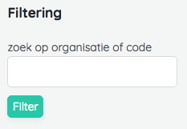

# Model Management

## Models and Managers

### Setting up your first manager
Let's start with a basic example case:
Our application already has an eloquent `Author` model which is used on the site and displayed on each page. Up to now
these records weren't subject to change and it was ok not to make them available in the admin section of the site.
Now our client asks if they can manage those authors. Yikes! But no sweat. This is something where our manager comes in...


### Creating a manager
In order to manage an eloquent model, we'll create a manager.

####  Implementing the contract
At the very least, a manager class needs to implement the `\Thinktomorrow\Chief\Management\ModelManager` interface.
This contract requires you to set the expected methods on your manager class.

::: tip INFO
We recommend you to extend the `\Thinktomorrow\Chief\Management\AbstractManager` class.
This class gives you out-of-the-box behaviour for most of the expected methods.
:::

An author manager looks something like this:

```php
# AuthorManager.php

<?php

use Thinktomorrow\Chief\Management\ModelManager;
use Thinktomorrow\Chief\Management\AbstractManager;

class AuthorManager extends AbstractManager implements ModelManager
{
    ...
}
```

#### Providing additional methods
When you extend from the AbstractManager, there's already a big chunk of the interfaces taken care of. There are, however , still some methods you'll need to implement yourself. Let's go over them.

#### ModelManager::fields
`ModelManager::fields(): Fields`

Here you define the model attributes to be managed in the admin. In Chief a single field can be represented by a `Field` class.
Each field class takes care of the form representation and validation.
[Learn more on fields in the fields section](#fields).

If we'd like our author to have a manageable name and bio, we can setup something like this:

```php
public function fields(): array
{
    return [
        InputField::make('name'),
        TextField::make('bio'),
    ];
}
```

#### Here is the full overview of all the methods expected for a ModelManager:
```php
// Methods provided by the AbstractManager
public function route($verb): ?string;
public function can($verb): bool;
public function fieldArrangement(): FieldArrangement;
public function getFieldValue($field);
public function setField(Field $field, Request $request);
public function saveFields(): ModelManager;
public function renderField(Field $field);
public function delete();
public function managerDetails(): ManagerDetails;

// Methods you'll need to implement for each model
public function manage(ManagedModel $model = null): ModelManager { ... }
public function fields(): array { ... }
public static function findById($id): ?ModelManager { ... }
public static function findAllManaged(): Collection { ... }
public function managedModelDetails(): ManagedModelDetails { ... }
```


### Registering a manager
Last thing to do is registering the manager which makes our manager available inside the Chief application.
You register a manager with the `register` command. A good place to put these registrations is in your project's `AppServiceProvider`.
```php
# App/Providers/AppServiceProvider

use \Thinktomorrow\Chief\Management\Register;

class AppServiceProvider extends ServiceProvider
{
    public function boot()
    {
        app(Register::class)->register(Author::managerKey(), AuthorManager::class);
    }

    ...
}
```
The register method takes two arguments: first you pass it the unique identifier of the manager. This string identifies the manager inside the chief internals.
This value should match the return value from Author::managerKey().

The second parameter is the reference to the ModelManager class.

### navigation
-> view in chief admin...

### Authorizing actions

## Fields

### Validating fields

- intro: eloquent model, custom object, Page and Module are 2 in-house types of managers
-

### Field

This is the basic field. You would not use this to define a field on a model.
Instead you define one of the more specific fields.
This class provides some global function that are useful for a field like if it's translatable, its validation, label and description.

A basic input field might look like this:

```php
InputField::make('title')->translatable(['en', 'nl'])
                        ->validation('required-fallback-locale|max:200')
                        ->label('Page Title')
                        ->description('Title to be used in the admin.'),
```

### DateField

This field will allow you to add a date to the model.
To display this date correctly across all pages you need to define the field in the dates array on the model.

```php
<?php
use Thinktomorrow\Chief\Pages\Page;
use Thinktomorrow\Chief\Common\Fields\DateField;
class DateItem extends Page
{
    public $dates   = ['date'];

    public function customFields()
    {
        return [
            'date' => DateField::make('date')->label('The date'),
        ];
    }
}

```

### DocumentField

The document field adds a file upload (any type) to the model.

One extra option is 'multiple' to define if the field may upload multiple files or just one.

### HtmlField

The Html field will render as a wysiwyg editor in the admin.

### InputField

This is the basic input element.

### MediaField

The document field adds media (png, jpg, jpeg, gif, etc) to the model.

One extra option is 'multiple' to define if the field may upload multiple files or just one.

### PageBuilderField

This field is responsible for the pagebuilder. This requires some extra setup if you want to customize these fields.
Although this field is present on pages by default so that shouldn't need more setup.

### SelectField

The selectfield renders a dropdown. It has options that you can pass along as well as the currently selected property.

```php
SelectField::make('pages')
            ->label('Page')
            ->description('Select a page')
            ->options($all_pages)
            ->multiple(false)
            ->selected($pageId);
```

### RadioField

The radio field renders radiobuttons. This extends the selectfield so it has all its features but just a different identifier.

### TextField

The textfield is the same as the Html field except that this does not render as a wysiwyg editor.

### HasPeriod fields

## Filters
It is possible to add filtering on the admin index pages. Filters allow the administrator to query index results with custom behaviour.
For example searching by title via a text input or selecting between published or drafted items. By default, there are no filters set on a manager. 

Let's add some filtering.

### Defining filters
Filters are defined in the Manager class via the `filters` method. This returns a `Thinktomorrow\Chief\Filters\Filters` instance which acts as the filter collection:
```php 
use \Thinktomorrow\Chief\Filters\Filters;
use \Thinktomorrow\Chief\Filters\Types\InputFilter;

...

public static function filters(): Filters
{
    return new Filters([
        InputFilter::make('title')->label('search by title')->query(function($query){
            return $query->where(function($query){
                return $query->where('title','LIKE','%'.request()->input('title').'%');
            });
        }),
    ]);
}
```


This will add a search field in the sidebar of your index like so:



### Input filter
The input filter allows the user to query by textual input. A search field is a good use case. As shown in the example above, there are
a couple of values to be set. 

Create a filter with the `Filter::make(<key>)` method. The key parameter identifies the input name and will be used a query key in the uri.
You can define the query to be run with the `Filter::query()` method. This expects a Closure which should return a query instance. 
Since all active filter values are present in the request uri, you can fetch them from the `request()` object.

Optionally you can add:
`Filter::label()` to set a custom label. By default the input name is used.
`Filter::description()` to add a small description below the field.

### Select filter
The select filter allows the user to choose between a set options. Here you should also set the options via a `SelectFilter::options()`.
```php 
SelectFilter::make('locale')
    ->options(['nl','fr'])
    ->query(function($query){
        return $query->where('locale',[request()->input('locale')]);
    });
```
