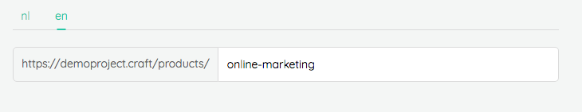

# Pages

## model

The easy setup for a page is to create a model that extends the chief page class

```php
use Thinktomorrow\Chief\Pages\Page;

class FaqPage extends Page
```

The next step is to link the manager.

Linking the models to their managers is done in the ChiefProjectServiceProvider.

For convenience there is a default PageManager and ModuleManager.
We'll come back to creating our own managers in de advanced management section.

So linking our FaqPage would go as follows:

```php
$this->registerPage('faq', PageManager::class, FaqPage::class);
```

While we're in the ChiefProjectServiceProvider file we might as well set up our morphMap:
 
```php
Relation::morphMap([
    'faq' => FaqPage::class
]);
```
We do this mapping so we don't have to access the class by it's full path, in code or in DB.

## url
Out of the box, there are two project routes expected by chief: `pages.show` and `pages.home`.

The `pages.show` serves as a catch all for displaying all Chief managed pages.
This catch-all route will point to a generic PagesController that directs the request
to the proper published page. Place this route at the end of your route definitions 
to avoid routes not triggering.

`pages.home` makes the distinction with other pages that it is accessible on the root url.

### Configure route names
You can change the way Chief page routing works in your application. 
If you like to use a different naming for the page routes, you can edit these in the `config/thinktomorrow/chief.php` config file.
```php
# config/thinktomorrow/chief.php

'routes' => [
    'pages-show' => 'pages.show',
    'pages-home' => 'pages.home',
],

```

### Customizing page urls
The page url can be adjusted per page and per locale. This is something that is managed in the admin. 
Slashes are allowed so, for example, _2019/our-job-offers_ is an exceptable link definition. 

Since pages are divided by type (news, articles, tips, ...), it makes sence to also reflect this grouping in their url.
You can set a predefined base url segment. This can be done by adding a `baseUrlSegment` property on your Page class.
```php
class Article extends Page
{
    protected static $baseUrlSegment = 'products';
}
```

All links will now start with this segment baked in. Here's how it looks for the admin:


```php
class Article extends Page
{
    protected static $baseUrlSegment = [
        'en' => 'products',
        'nl' => 'producten',
    ];
}
```

### Using a custom route resolver
By default the `route()` helper is used for resolving page routes. You can change the way you resolve this route by defining a Closure in the boot method of your `ChiefProjectServiceProvider`. 
Here we have an example where we use the `localeroute()` helper from our [locale package](https://github.com/thinktomorrow/locale).
```php
# App/Providers/ChiefProjectServiceProvider.php

use Thinktomorrow\Chief\Pages\Page;

class ChiefProjectServiceProvider
{
    public function boot()
    {
        Page::setRouteResolver(function($name, $parameters = [], $locale = null){
            return localeroute($name, $locale, $parameters);
        });
    }
}

```


## views

There are a couple places we can put the view file for a page.
They will be used in order and will use the first one that exists.
The order is as follows:

```
'front/PAGE_MORPHKEY/show'
'front/pages/PAGE_MORPHKEY/show'
'front/pages/show'
'pages/show'
```

So for instance for the FaqPage we set up in the previous section the views it searches are:

```
'front/faq/show'
'front/pages/faq/show'
'front/pages/show'
'pages/show'
```

## Adding modules
To create a module you make a file in the src/Modules folder.
These modules should extend 'Thinktomorrow\Chief\Modules\Module'.

To define the name of this module in the admin panel you can define the 'labelSingular' and 'labelPlural' property

```php
<?php

namespace Project\Modules;

use Thinktomorrow\Chief\Common\Collections\CollectionDetails;
use Thinktomorrow\Chief\Modules\Module;

class Hero extends Module
{
    protected $labelSingular = 'hoofding';
    protected $labelPlural   = 'hoofdings';
}
```

The next thing to do is to add a reference to this module in the chief.php config file.

You will most often define it in 2 places in this config file.
You need to define the module in the collections array so the admin has knowledge of this new module.

The second place might not always be needed. If we define the module in the relations>children array
the module will be available to add to a page.

```php
'relations'   => [

        'children' => [
            \Thinktomorrow\Chief\Pages\Page::class,
            
            Hero::class,
            ...
        ],
        ...
    ],

    /**
     * Here you should provide the mapping of page and module collections. This
     * is required for the class mapping from database to their respective classes.
     */
    'collections' => [
        ...
        // Modules
        'heros'        => Hero::class,
        ...
    ],
```

### Customizing modules
Next to the module model where we can set the names to be used, we can also customize the view that would be used.

To create a view for this specific module, we create views/front/modules/hero.blade.php in this case.
The name of the view should be the same as the module type.

In this view we have access to the $module variable.
And there's a few thing we have access to throught that.

We can get the title, content, and if we have media files attached we can retrieve them as you can see in the example below.

```php
<div class="hero" style="background: url({{ $module->mediaUrl(\Thinktomorrow\Chief\Media\MediaType::BACKGROUND) }}) no-repeat; background-size:cover; background-position:center;">
    <div class="container hero-title">
        <h1 class="text-white text-shade-on-white">{{ $module->title }}</h1>
        @if($module->content)
            <div class="editor-content text-white text-shade-on-white text-2xl">
                {!! $module->content !!}
            </div>
        @endif
    </div>
</div>
```

### Module view paths

There are a couple places we can put the view file for a page.
They will be used in order and will use the first one that exists.
The order is as follows:

```
'front/modules/PARENT_MORPHKEY/PAGE_MORPHKEY'
'front/modules/PAGE_MORPHKEY'
'modules/PARENT_MORPHKEY/PAGE_MORPHKEY'
'modules/PAGE_MORPHKEY'
```

So for instance lets imagine a module 'contact' we want to style for the 'FaqPage' the views are as follows:

```
'front/modules/faq/contact'
'front/modules/contact'
'modules/faq/contact'
'modules/contact'
```

Once this setup is done we can create instances of these modules from the admin panel.
And following that to add them to a page, simple select them from the pagebuilder dropdown.
