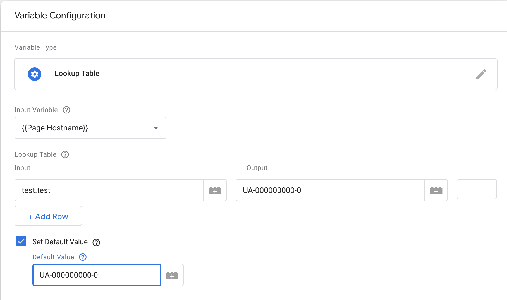

# Google Tag Manager

We use GTM to implement tags or analytics tracking without needing to change the code every time.

## Setup

To get started we create a property under a company account for the client or under the Think Tomorrow account.

Next we create a few basic variables to help out in our development.

To make it easier for testing and to keep our tracking properties clean we set up a lookup table.
This lookup table will switch the Analytics id based on the current page hostname.
This way we can split up our tracking on different properties for localization or just for testing.

First we create a variable with the type 'lookup table'.
As input we choose 'Page Hostname'.

Then we can start setting up the properties we want.
As a basic setup we create a production property and link that to the live domain.

A staging property can be set up if we want to test analytics implementations on the staging environment.

You can define properties per locale if the situation calls for it.

Lastly we advise to set up your local urls to a dummy analytics property to test if GTM passes the data as we would expect.
You can also set the default value to this dummy property.

To use this we need to create a 'Google Analytics settings' variable type and select the lookup table as tracking ID.

Now that we have the lookup table as a GA variable, we can link this variable to the tags that need the GA id.

## Usage

As far as usage of GTM goes, we use the features that GTM provides us like versioning and previewing.
Every tag/variable/trigger/etc you create are changes in your workspace.
These changes have no effect until you preview them.

:::warning
If you submit your changes every site with this tag will have these changes applied!
:::

When you press preview, GTM will place a cookie in your browser that triggers the GTM debug bar if the corresponding GTM tag is detected on a page you're browsing.

This banner means your preview mode is activated for this GTM property.

If we then browse to a site with this tag, we see the following debug bar.

After we checked all these changes we can publish the changes as a new version which then will be active on all the sites that implement this tag.

## Basic pageview GA tracking

Basic pageview tracking with GTM is very easy.

- create a new tag
- select 'Google Analytics - Universal Analytics'
- choose pageview track type
- assuming you have set up the lookup table variable, choose that variable for the 'Google Analytics settings'
- choose a trigger
- click the + in the top right to add a new trigger
- create a page view trigger
- select all pages

## Custom JS/HTML tags

To implement pure html/js snippets like hotjar/smartlook/hubspot/etc we can create a tag for that as well.

Create a new tag and select Custom HTML. 

Input the custom tag here and select a trigger. Most often you will want this to trigger on every page but you may want to change this based on your needs.

## GA event tracking

There are multiple ways to implement event tracking using GTM and analytics. 
We list a few ways that we use the most here.
### Basic event tracking

Setting up basic event tracking as fairly easy using GTM.
We would use this way of tracking if the following applies:
- don't have access or don't want to change the codebase
- classes on the elements you want to track are unique enough

If these are the case we can start by creating a 'Google Analytics - Universal Analytics' tag.
Select 'Event' as the track type.

Next you can fill in the tracking parameters.
- category
- action
- label
- value

Set the Google Analytics setting to the Lookup table Variable.

Now the triggering of event tracking is a little more complicated.

Most of the time you will use click triggers.
To create a click trigger:

- click on triggering
- click the + in the top right corner to create a new trigger
Choose one of the following:
    - select 'just links' to trigger clicks on links.
        - select 'some link clicks'
        - choose the link conditionals
    - select 'all elements' to trigger clicks on all elements
        - select 'some clicks'
        - choose the conditionals that trigger this tag

More complex triggering is possible but these most often require some developer input.

### Trigger on data-attributes

The second way is to use data-attributes in the codebase.
We would use this way of tracking if the following applies:
- have access to the codebase
- classes on the elements you want to track are not unique enough
- we need to trigger multiple events with predefined catagory/label/actions

It is also possible to trigger a click or anything really on a data- attribute you define yourself.
Let me run you through how to set this up.

First lets define a new variable of the type 'data-layer-variable'.

Then as the name, and this is the key, we set 'gtm.element.dataset.' and then anything you want.
For us this is 'gtm.element.dataset.event'.

Now we can use this variable in every trigger to check whether this value is what we want to track.

For instance: 
If we want to track a button we can add 'data-event="buttonTrack"' on the button, try to make it as unique as possible.

Next as the trigger we just select data-event from the dropdown and set the equals to 'buttonTrack'.

::: warning
When adding tracking on elements that are or contain svg's the click might not bubble up to the correct element.
If you encounter this make sure to add `pointer-events:none;` to the svg and all sub-elements.
:::

### Dynamic event setup

The third way is to use a dynamic event which is filled through the data layer.
We would use this way of tracking if the following applies:
- have access to the codebase
- classes on the elements you want to track are not unique enough
- we need to trigger multiple events with dynamic category, label or action that we want to pass along from the code.

Sometimes it can be easier to set up your events in the code instead of in GTM.
One simple way to do this is to configure a dynamic event in GTM.

First we create a 'data-layer variable' for each one of our event variables.
So create a variable for the event action, category, description, label, value.

The name you choose for these variables are the keys we will use in our datalayer to link our inputs to GTM.

The last step is to add a trigger that listens to the event name. In this case that would be 'HubspotForm' but you can choose something more general or more specific as you prefer.

And that is it. Now we can push events to the datalayer and the GTM tags will capture and fire the events with the names you have defined in your code.